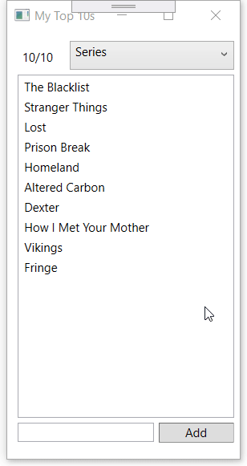

# oe-lussen-reeksen-top10-opl

## Opgave
Schrijf een applicatie waar je jouw top 10's kan bijhouden voor bepaalde categorieën.
Zorg er dus zeker voor dat de lijst maximaal 10 items kan bevatten!

De gebruiker selecteert een categorie in een ComboBox waarna de top 10 ervan wordt weergeven. Selecteer hij iets anders, dan wordt de andere categorie mét de ingevoerde waardes getoond.



## Aandachtspunten
* De categorieën worden __hardgecodeerd__. Dit wil zeggen dat je ze letterlijk vastlegt in je code. Indien je een array gebruikt, lees je dus iets zoals:
```
categories = new string[6] { 
                "Movies", 
                "Music albums",
                "Series",
                "Computer games",
                "Board games",
                "Books"
            };
```

* Deze oefening maakt gebruik van lijsten binnin een lijst.
* Maak gebruik van het `const` keyword om bij te houden dat je met 10 items (top 10) werkt. Dit is namelijk onveranderlijk ...
* Voorzie code die de gebruiker op de hoogte stelt van foutieve ingave.

